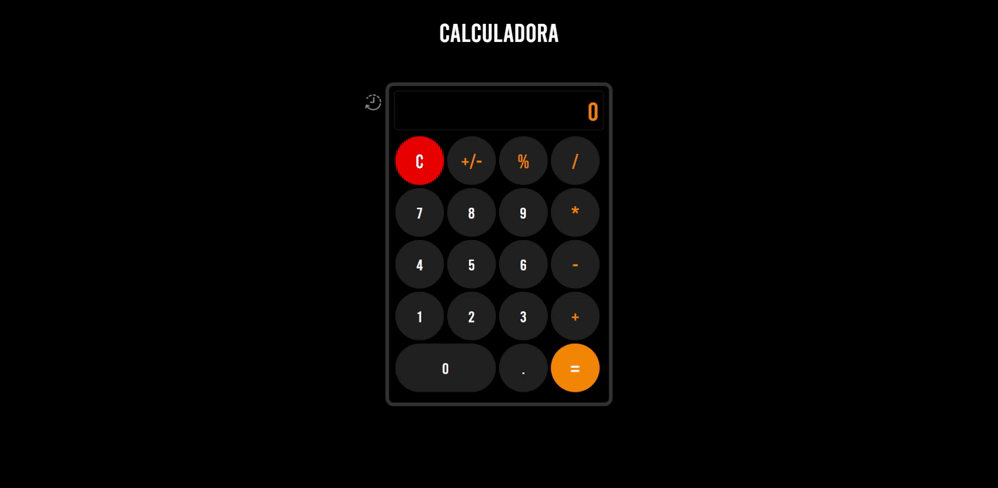

<h1 align="left">Projeto Calculadora</h1>

<h4 align="left">Calculadora com Histórico</h4>

 

## Futuras atualizações

 Funcionalidade que tranformará a calculadora em uma calculadora científica

### Tecnologias usadas:

 

&nbsp;
&nbsp;
&nbsp;